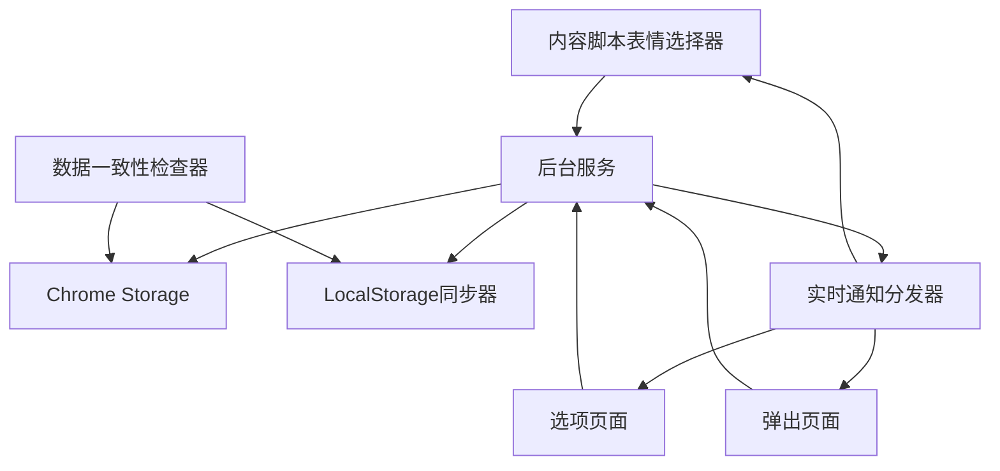

# 表情实时同步功能设计文档

## 1. 概述

本文档描述了浏览器扩展中表情数据实时同步功能的技术设计。该功能旨在解决当前扩展中表情使用统计、显示顺序、分组图标等数据在不同组件间（前端注入脚本、后台服务、选项页面、弹出页面）无法实时同步的问题。

设计基于现有的通信架构，通过增强消息传递机制、优化数据存储策略和改进UI响应机制来实现实时同步。

## 2. 架构

### 2.1 当前架构分析

现有系统包含以下组件：
- **后台服务 (Background Script)**: 管理数据存储和跨组件通信
- **内容脚本 (Content Script)**: 在网页中注入表情选择器
- **选项页面 (Options Page)**: 管理表情分组和设置
- **弹出页面 (Popup)**: 快速访问表情功能

### 2.2 同步架构设计



## 3. 组件和接口

### 3.1 增强的通信服务

**新增消息类型:**
```typescript
interface SyncMessage extends Message {
  type: 'COMMON_EMOJI_UPDATED' | 'EMOJI_ORDER_CHANGED' | 'GROUP_ICON_UPDATED' | 'UNGROUPED_EMOJIS_CHANGED'
  payload: {
    uuid?: string
    groupUUID?: string
    commonGroup?: EmojiGroup
    updatedOrder?: string[]
    iconUrl?: string
    ungroupedEmojis?: Emoji[]
    timestamp: number
  }
}
```

**增强的CommunicationService方法:**
```typescript
interface EnhancedCommunicationService extends CommunicationService {
  // 新增方法
  sendCommonEmojiUpdated(commonGroup: EmojiGroup): void
  sendEmojiOrderChanged(groupUUID: string, newOrder: string[]): void
  sendGroupIconUpdated(groupUUID: string, iconUrl: string): void
  sendUngroupedEmojisChanged(ungroupedEmojis: Emoji[]): void
  
  // 新增监听器
  onCommonEmojiUpdated(handler: (group: EmojiGroup) => void): void
  onEmojiOrderChanged(handler: (groupUUID: string, order: string[]) => void): void
  onGroupIconUpdated(handler: (groupUUID: string, iconUrl: string) => void): void
  onUngroupedEmojisChanged(handler: (emojis: Emoji[]) => void): void
}
```

### 3.2 数据同步管理器

**新组件: DataSyncManager**
```typescript
class DataSyncManager {
  private storageWatcher: StorageWatcher
  private consistencyChecker: ConsistencyChecker
  private notificationQueue: NotificationQueue
  
  // 监控存储变化
  watchStorageChanges(): void
  
  // 检查数据一致性
  checkConsistency(): Promise<boolean>
  
  // 同步localStorage和Chrome Storage
  syncStorages(): Promise<void>
  
  // 批量处理通知
  processPendingNotifications(): void
}
```

### 3.3 存储一致性检查器

**新组件: ConsistencyChecker**
```typescript
class ConsistencyChecker {
  // 比较localStorage和Chrome Storage中的数据
  compareStorages(): Promise<{
    isConsistent: boolean
    differences: StorageDifference[]
  }>
  
  // 解决数据冲突
  resolveConflicts(differences: StorageDifference[]): Promise<void>
  
  // 验证数据完整性
  validateDataIntegrity(data: any): boolean
}
```

### 3.4 实时UI更新器

**增强的UI组件响应机制:**
```typescript
interface RealtimeUIUpdater {
  // 立即更新常用表情显示
  updateCommonEmojis(commonGroup: EmojiGroup): void
  
  // 立即更新表情排序
  updateEmojiOrder(groupUUID: string, newOrder: string[]): void
  
  // 立即更新分组图标
  updateGroupIcon(groupUUID: string, iconUrl: string): void
  
  // 立即显示未分组表情
  updateUngroupedEmojis(emojis: Emoji[]): void
  
  // 强制刷新UI组件
  forceRefresh(): void
}
```

## 4. 数据模型

### 4.1 增强的存储结构

```typescript
interface EnhancedStorageData {
  // 现有数据
  'emojiGroups-common': EmojiGroup
  'emojiGroups-index': string[]
  [key: `emojiGroups-${string}`]: EmojiGroup
  
  // 新增同步元数据
  'sync-metadata': {
    lastSyncTimestamp: number
    version: string
    checksums: {
      [key: string]: string
    }
  }
  
  // 新增未分组表情专用存储
  'ungrouped-emojis': Emoji[]
  
  // 新增排序缓存
  'emoji-order-cache': {
    [groupUUID: string]: {
      order: string[]
      lastUpdated: number
    }
  }
}
```

### 4.2 同步状态跟踪

```typescript
interface SyncState {
  isOnline: boolean
  lastSyncTime: number
  pendingChanges: PendingChange[]
  conflictResolution: 'chrome-storage' | 'local-storage' | 'merge'
}

interface PendingChange {
  type: 'usage' | 'order' | 'icon' | 'ungrouped'
  target: string // UUID或标识符
  data: any
  timestamp: number
  retryCount: number
}
```

## 5. 错误处理

### 5.1 同步失败处理

```typescript
class SyncErrorHandler {
  // 处理存储写入失败
  handleStorageWriteError(error: Error, data: any): Promise<void>
  
  // 处理通信失败
  handleCommunicationError(error: Error, message: Message): Promise<void>
  
  // 处理数据冲突
  handleDataConflict(conflict: DataConflict): Promise<void>
  
  // 重试机制
  retryOperation(operation: () => Promise<void>, maxRetries: number): Promise<void>
}
```

### 5.2 降级策略

1. **通信失败降级**: 如果跨组件通信失败，回退到轮询检查
2. **存储失败降级**: 如果Chrome Storage失败，临时使用localStorage
3. **UI更新失败降级**: 如果实时更新失败，提供手动刷新选项

## 6. 测试策略

### 6.1 单元测试

- **DataSyncManager测试**: 验证数据同步逻辑
- **ConsistencyChecker测试**: 验证数据一致性检查
- **通信服务测试**: 验证消息传递机制
- **存储操作测试**: 验证存储读写操作

### 6.2 集成测试

- **跨组件同步测试**: 验证不同组件间的数据同步
- **存储一致性测试**: 验证localStorage和Chrome Storage的一致性
- **实时更新测试**: 验证UI的实时响应能力
- **错误恢复测试**: 验证各种错误场景的处理

### 6.3 端到端测试

- **表情使用流程测试**: 从使用表情到所有界面更新的完整流程
- **数据持久化测试**: 验证浏览器重启后的数据恢复
- **并发操作测试**: 验证多个组件同时操作时的数据一致性
- **网络异常测试**: 验证网络不稳定时的同步行为

## 7. 性能优化

### 7.1 批量更新机制

```typescript
class BatchUpdateManager {
  private updateQueue: UpdateOperation[] = []
  private batchTimer: NodeJS.Timeout | null = null
  
  // 添加更新操作到队列
  queueUpdate(operation: UpdateOperation): void
  
  // 批量处理更新
  processBatch(): Promise<void>
  
  // 立即处理高优先级更新
  processImmediate(operation: UpdateOperation): Promise<void>
}
```

### 7.2 缓存策略

- **内存缓存**: 缓存频繁访问的表情数据
- **时间戳缓存**: 避免重复的数据检查
- **增量更新**: 只同步变化的数据部分

### 7.3 防抖和节流

```typescript
// 防抖：避免频繁的UI更新
const debouncedUIUpdate = debounce(updateUI, 100)

// 节流：限制存储写入频率
const throttledStorageWrite = throttle(writeToStorage, 500)
```

## 8. 实现优先级

### 8.1 高优先级 (P0)
- 表情使用统计实时同步
- 常用表情排序一致性
- 基础错误处理

### 8.2 中优先级 (P1)
- 未分组表情显示
- 分组图标实时更新
- 数据一致性检查

### 8.3 低优先级 (P2)
- 性能优化
- 高级错误恢复
- 详细的同步状态显示