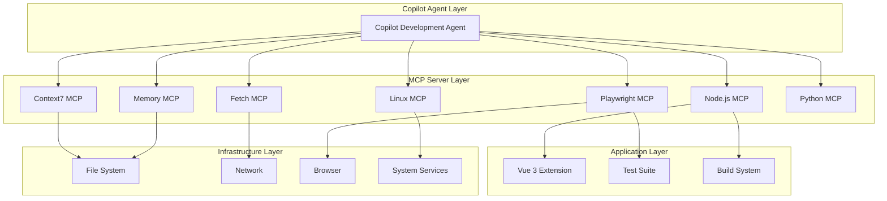

# Comprehensive Copilot Development Environment Architecture

## Overview

This document outlines the complete architecture of the enhanced Copilot development environment for the `stevessr/bug-v3` repository. The system integrates multiple MCP (Model Context Protocol) servers to provide a comprehensive, intelligent development experience.

## System Architecture

### Core Components



## MCP Server Architecture

### 1. Context7 MCP - Enhanced Context Management
**Purpose**: Intelligent project context and workflow optimization

**Core Capabilities**:
- Project structure analysis and understanding
- Context-aware code suggestions
- Workflow pattern recognition
- Intelligent next-action recommendations

**Key Tools**:
- `store_context()`: Store development context with metadata
- `retrieve_context()`: Query and retrieve stored context
- `analyze_project_structure()`: Deep project analysis
- `suggest_next_actions()`: AI-powered suggestions

**Integration Points**:
- File change monitoring
- Build process hooks
- Error recovery workflows
- Agent coordination

### 2. Memory MCP - Long-term Persistence
**Purpose**: Persistent memory and pattern learning

**Core Capabilities**:
- Long-term conversation and code memory
- Semantic search and similarity matching
- Pattern recognition and insight generation
- Automatic memory cleanup and optimization

**Key Tools**:
- `store_memory()`: Persistent memory storage
- `search_similar()`: Semantic similarity search
- `analyze_patterns()`: Pattern discovery
- `get_insights()`: Insight generation

**Integration Points**:
- Solution pattern storage
- Error pattern learning
- Workflow optimization
- Cross-session persistence

### 3. Node.js MCP - JavaScript/TypeScript Development
**Purpose**: Complete Node.js ecosystem management

**Core Capabilities**:
- Package management (npm/pnpm/yarn)
- Build system integration (Vite/Webpack)
- Testing framework support (Jest/Vitest)
- Code quality tools (ESLint/Prettier)

**Key Tools**:
- `execute_node()`: Node.js script execution
- `run_npm_script()`: Package.json script execution
- `build_project()`: Build system integration
- `analyze_dependencies()`: Dependency analysis

**Integration Points**:
- Vue 3 component development
- TypeScript compilation
- Extension packaging
- CI/CD pipeline

### 4. Playwright MCP - Browser Automation
**Purpose**: End-to-end testing and browser automation

**Core Capabilities**:
- Multi-browser testing (Chromium/Firefox/WebKit)
- Extension testing and validation
- Visual regression testing
- Accessibility compliance testing

**Key Tools**:
- `launch_browser()`: Browser instance management
- `install_extension()`: Extension installation
- `test_extension_popup()`: Popup testing
- `capture_screenshot()`: Visual testing

**Integration Points**:
- Browser extension testing
- E2E workflow validation
- Performance monitoring
- Cross-browser compatibility

### 5. Linux MCP - System Operations
**Purpose**: System-level operations and environment management

**Core Capabilities**:
- Browser installation and configuration
- System service management
- Environment variable management
- Resource monitoring

**Key Tools**:
- `execute_command()`: Shell command execution
- `install_browser()`: Browser installation
- `configure_browser()`: Browser configuration
- `monitor_system()`: Resource monitoring

**Integration Points**:
- Development environment setup
- Browser plugin management
- System resource optimization
- Service health monitoring

### 6. Fetch MCP - Network Operations
**Purpose**: HTTP requests and API testing

**Core Capabilities**:
- RESTful API testing
- GraphQL query testing
- Webhook validation
- File upload/download operations

**Key Tools**:
- `http_request()`: Custom HTTP requests
- `test_api_endpoint()`: API endpoint validation
- `upload_file()`: File upload handling
- `monitor_endpoint()`: Endpoint monitoring

**Integration Points**:
- API development and testing
- External service integration
- Data validation workflows
- Network performance monitoring

### 7. Python MCP - Python Scripting
**Purpose**: Python-based automation and validation

**Core Capabilities**:
- Python script execution
- Data validation and processing
- Testing framework integration
- Virtual environment management

**Key Tools**:
- `execute_python()`: Python code execution
- `validate_data()`: Data validation
- `run_tests()`: Python test execution
- `create_virtualenv()`: Environment management

**Integration Points**:
- Data processing scripts
- Validation workflows
- Automation tasks
- Utility script execution

## Development Workflow Integration

### 1. Intelligent Development Cycle

```javascript
// Context-aware development workflow
async function intelligentDevelopmentCycle(task) {
  // 1. Analyze current context
  const context = await context7.analyze_project_structure();
  
  // 2. Retrieve relevant memories
  const memories = await memory.search_similar({
    reference: task,
    threshold: 0.8
  });
  
  // 3. Execute development task
  const result = await nodejs.execute_task(task);
  
  // 4. Store learning
  await memory.store_memory({
    content: result,
    memory_type: "development_pattern",
    tags: ["workflow", "solution"]
  });
  
  // 5. Validate with tests
  await playwright.run_test_suite({
    suite_name: "validation",
    parallel: true
  });
}
```

### 2. Error Recovery and Learning

```javascript
// Automated error recovery
async function handleError(error) {
  // Store error pattern
  await memory.store_memory({
    content: error,
    memory_type: "error_pattern",
    importance: 8
  });
  
  // Find similar past errors
  const similarErrors = await memory.search_similar({
    reference: error.message,
    threshold: 0.7
  });
  
  // Get recovery suggestions
  const suggestions = await context7.suggest_next_actions({
    current_task: "error_recovery",
    project_state: { error }
  });
  
  return suggestions;
}
```

### 3. Comprehensive Testing Pipeline

```javascript
// Multi-layer testing approach
async function comprehensiveTest() {
  // Unit tests
  await nodejs.run_tests({
    framework: "jest",
    coverage: true
  });
  
  // Integration tests
  await fetch.test_api_endpoint({
    endpoint: "/api/health"
  });
  
  // E2E tests
  await playwright.test_extension_popup({
    test_scenarios: ["user_interaction", "data_persistence"]
  });
  
  // Performance tests
  await linux.monitor_system({
    metrics: ["cpu", "memory"],
    duration: 60
  });
}
```

## Data Flow Architecture

### Context Flow
1. **Input**: File changes, user actions, system events
2. **Processing**: Context7 analyzes and categorizes
3. **Storage**: Memory MCP stores with semantic indexing
4. **Retrieval**: Smart context retrieval for decision-making
5. **Output**: Context-aware suggestions and actions

### Memory Flow
1. **Capture**: Continuous learning from development patterns
2. **Index**: Semantic indexing for similarity search
3. **Analyze**: Pattern recognition and insight generation
4. **Retrieve**: Contextual memory retrieval
5. **Apply**: Memory-informed development decisions

### Testing Flow
1. **Build**: Node.js MCP builds the application
2. **Deploy**: Linux MCP manages deployment
3. **Test**: Playwright MCP executes comprehensive tests
4. **Validate**: Fetch MCP validates API endpoints
5. **Report**: Memory MCP stores test patterns

## Security Architecture

### Sandboxed Execution
- All MCP servers operate in controlled environments
- Restricted file system access with explicit permissions
- Network access limited to allowed domains
- Process isolation and resource limits

### Data Privacy
- All data processing occurs locally
- No external data transmission without explicit consent
- Encrypted storage for sensitive context
- Automatic cleanup of temporary data

### Access Control
- Role-based access to MCP server functions
- Audit logging for security operations
- Secure credential management
- Input validation and sanitization

## Performance Optimization

### Parallel Processing
- Concurrent MCP server operations
- Async/await patterns for non-blocking execution
- Intelligent caching across servers
- Resource pooling and reuse

### Memory Management
- Automatic garbage collection
- Memory usage monitoring
- Intelligent data eviction
- Compression for stored context

### Network Optimization
- Request batching and deduplication
- Response caching with TTL
- Connection pooling
- Retry logic with exponential backoff

## Configuration Management

### Environment Configuration
```bash
# .env.mcp
NODE_ENV=development
DEBUG=mcp:*
PLAYWRIGHT_BROWSERS_PATH=./browsers
MCP_LOG_LEVEL=info
MCP_CACHE_ENABLED=true
MCP_MEMORY_LIMIT=2GB
PROJECT_ROOT=/home/runner/work/bug-v3/bug-v3
```

### Server Prioritization
1. **High Priority**: Context7, Memory, Node.js
2. **Medium Priority**: Playwright, Linux, Fetch
3. **Low Priority**: Python

### Startup Sequence
1. Context7 MCP (context management)
2. Memory MCP (memory initialization)
3. Node.js MCP (primary development tools)
4. Playwright MCP (testing infrastructure)
5. Linux MCP (system services)
6. Fetch MCP (network services)
7. Python MCP (utility scripts)

## Monitoring and Observability

### Health Monitoring
- MCP server health checks
- Resource usage monitoring
- Error rate tracking
- Performance metrics collection

### Logging Strategy
- Structured logging across all servers
- Centralized log aggregation
- Error tracking and alerting
- Performance profiling

### Metrics Collection
- Development workflow metrics
- Test execution statistics
- System resource usage
- Network performance data

## Future Extensibility

### Plugin Architecture
The MCP server architecture supports easy extension through:
- Standard MCP protocol compliance
- Modular server design
- Configuration-driven server management
- Hot-pluggable server support

### Integration Points
- CI/CD pipeline integration
- IDE/Editor plugin support
- External tool integration
- Cloud service connectivity

## Best Practices

### Development Workflow
1. Always check context before making changes
2. Store significant decisions in memory
3. Use parallel testing approaches
4. Monitor system resources during development
5. Validate changes with comprehensive tests

### Memory Management
1. Tag memories appropriately for easy retrieval
2. Regular pattern analysis for optimization
3. Cleanup outdated or irrelevant memories
4. Maintain memory quality through validation

### Testing Strategy
1. Multi-browser extension testing
2. Automated visual regression testing
3. API endpoint validation
4. Performance benchmarking
5. Accessibility compliance checks

This comprehensive architecture provides a robust, intelligent, and extensible development environment that learns and improves over time, enabling highly efficient and quality-focused development workflows.