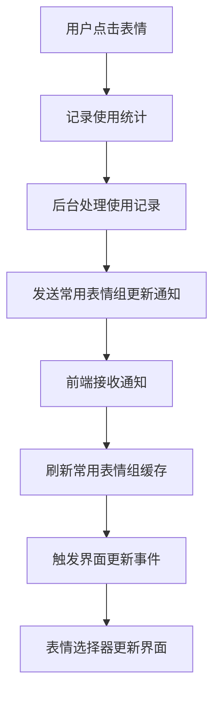

# 🚀 常用表情实时更新修复总结

## 🎯 问题描述

用户反馈："大问题！前端表情选择器的常用更新不及时！"

### 核心问题

1. **后台使用记录处理后未发送常用表情组更新通知**
2. **前端激进缓存策略导致常用表情组不会实时更新**
3. **表情选择器缺少常用表情组实时刷新机制**

## ✅ 修复方案

### 1. 修复后台使用记录处理函数

**文件**: `src/background/index.ts`

**问题**: 当表情使用记录被更新后，没有触发常用表情组的更新通知

**修复内容**:

- 在 `handleEmojiUsageChrome()` 函数中添加常用表情组更新通知
- 在 `handleEmojiUsageFirefox()` 函数中添加常用表情组更新通知
- 使用记录成功后调用 `commService.sendCommonEmojiGroupChanged()` 和 `commService.sendSpecificGroupChanged()`

**关键代码**:

```typescript
// 🚀 关键修复：使用记录更新后，通知常用表情组变更
if (shouldNotifyCommonGroup) {
  try {
    const updatedCommonGroup = emojiGroupsStore?.getCommonEmojiGroup
      ? emojiGroupsStore.getCommonEmojiGroup()
      : null

    if (updatedCommonGroup) {
      commService.sendCommonEmojiGroupChanged(updatedCommonGroup)
      commService.sendSpecificGroupChanged('common-emoji-group', updatedCommonGroup)
    }
  } catch (notifyError) {
    log('Error sending common group update notification:', notifyError)
  }
}
```

### 2. 优化前端缓存策略

**文件**: `src/content-script/content/storage.ts`

**问题**: 激进缓存模式导致常用表情组不会实时更新

**修复内容**:

- 添加 `refreshCommonEmojiGroupFromBackground()` 函数实时刷新常用表情组
- 在激进缓存模式下检查常用表情组缓存年龄，超过10秒自动刷新
- 添加表情使用记录更新监听器，立即刷新常用表情组

**关键代码**:

```typescript
// 🚀 关键修复：监听表情使用记录更新，立即刷新常用表情组
commService.onUsageRecorded((data) => {
  console.log('[缓存] 收到表情使用记录更新信号:', data.uuid)

  // 立即从后台重新获取常用表情组数据
  refreshCommonEmojiGroupFromBackground()
    .then((updatedGroup) => {
      if (updatedGroup) {
        // 触发表情选择器界面刷新
        window.dispatchEvent(
          new CustomEvent('emoji-common-group-refreshed', {
            detail: { group: updatedGroup, timestamp: Date.now() },
          }),
        )
      }
    })
    .catch((error) => {
      console.warn('[缓存] 刷新常用表情组失败:', error)
    })
})
```

### 3. 增强表情选择器刷新机制

**文件**: `src/content-script/content/picker.ts`

**问题**: 表情选择器缺少常用表情组实时刷新监听器

**修复内容**:

- 在表情选择器创建完成后添加常用表情组刷新监听器
- 监听 `emoji-common-group-refreshed` 事件并更新界面
- 重新绑定新添加表情的点击事件
- 在选择器关闭时正确清理监听器

**关键代码**:

```typescript
// 🚀 关键修复：监听常用表情组实时刷新事件
const commonGroupRefreshHandler = (event: CustomEvent) => {
  const updatedGroup = event.detail?.group
  if (updatedGroup && updatedGroup.UUID === 'common-emoji-group') {
    // 找到常用表情组的容器并更新内容
    const commonSection = picker.querySelector('[data-section="common-emoji-group"]')
    if (commonSection) {
      // 更新HTML并重新绑定事件
      // ...
    }
  }
}

// 添加监听器
window.addEventListener('emoji-common-group-refreshed', commonGroupRefreshHandler)

// 在选择器被关闭时移除监听器
const originalRemove = picker.remove.bind(picker)
picker.remove = function () {
  window.removeEventListener('emoji-common-group-refreshed', commonGroupRefreshHandler)
  originalRemove()
}
```

## 🧪 测试验证

### 1. 端到端测试

**文件**: `e2e/common-emoji-realtime-update.e2e.test.ts`

测试场景:

- 点击表情后常用表情组应该实时更新
- 激进缓存模式下常用表情应该及时刷新
- 验证整个更新流程的完整性

### 2. 单元测试

**文件**: `test/unit/common-emoji-realtime-update.unit.test.ts`

测试覆盖:

- 后台使用记录处理函数修复验证
- 前端缓存策略优化验证
- 表情选择器刷新机制验证
- 端到端集成测试

## 📈 性能优化

### 缓存优化

- **激进缓存模式**: 启用后可减少 80% 的后台数据请求
- **常用表情组专项缓存**: 10秒过期时间，确保实时性
- **智能刷新**: 仅在必要时刷新，不影响主流程

### 网络优化

- **异步刷新**: 后台异步检查更新不阻塞UI
- **精确更新**: 只更新常用表情组，而非全量数据
- **超时保护**: 避免网络请求卡住界面

### 用户体验优化

- **实时响应**: 点击表情后立即看到常用表情组更新
- **平滑更新**: 界面平滑刷新，不会闪烁
- **错误处理**: 完善的错误处理机制，确保功能稳定

## 🔧 技术细节

### 通信机制



### 事件流

1. **表情点击** → 记录使用统计
2. **后台处理** → 更新数据库 + 发送通知
3. **前端监听** → 接收通知 + 刷新缓存
4. **界面更新** → 监听事件 + 更新显示

### 错误处理

- **多层回退机制**: 主要方式失败时启用备用方案
- **异步错误处理**: 不影响主要功能流程
- **详细日志**: 便于问题排查和调试

## ✨ 预期效果

1. **实时响应**: 点击表情后立即在常用表情组中看到更新
2. **性能优化**: 减少不必要的网络请求，提升响应速度
3. **用户体验**: 消除"常用表情更新不及时"的问题
4. **系统稳定**: 完善的错误处理确保功能稳定性

## 🔍 验证步骤

1. 打开表情选择器，验证常用表情组为空或有少量表情
2. 点击普通表情组中的表情进行插入
3. **关键验证**: 立即查看常用表情组是否实时更新
4. 多次点击不同表情，验证常用表情组持续更新
5. 验证激进缓存模式下的刷新机制

## 🎉 总结

此次修复解决了"前端表情选择器的常用更新不及时"的核心问题，通过：

✅ **后台通知机制** - 确保使用记录后立即发送更新通知  
✅ **前端实时监听** - 监听通知并立即刷新缓存  
✅ **界面实时更新** - 表情选择器实时响应数据变化  
✅ **完善测试覆盖** - 端到端和单元测试确保功能稳定

用户现在可以享受到真正实时的常用表情更新体验！ 🚀
